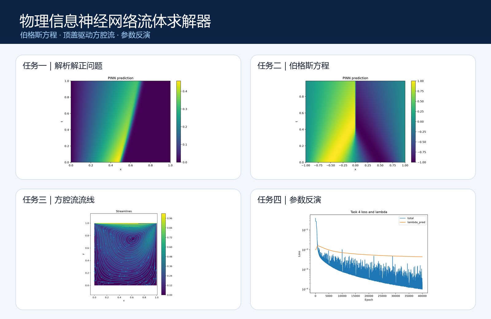
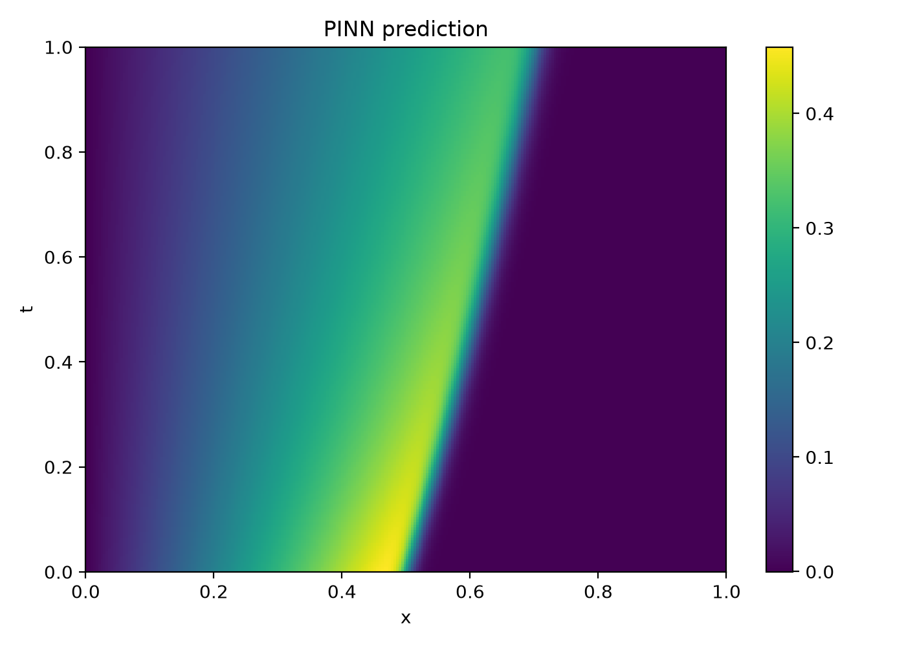
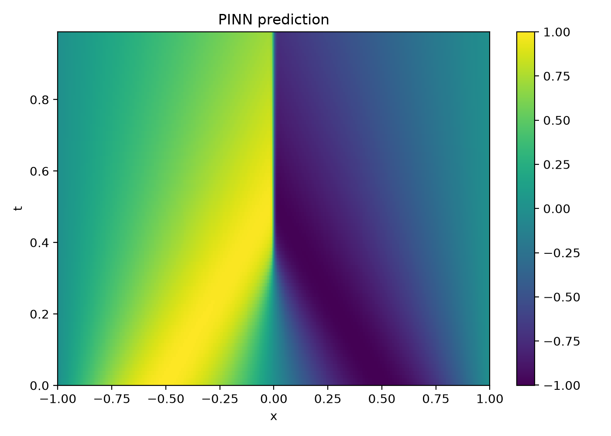
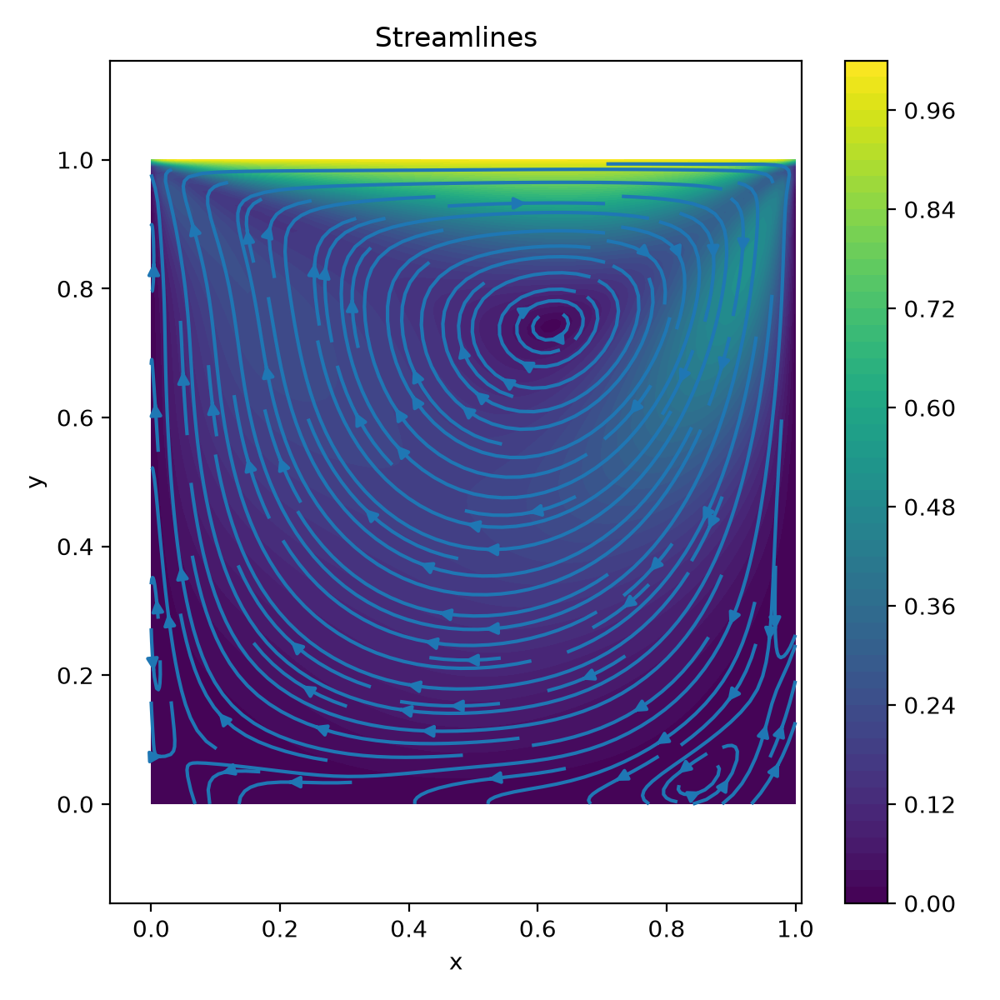
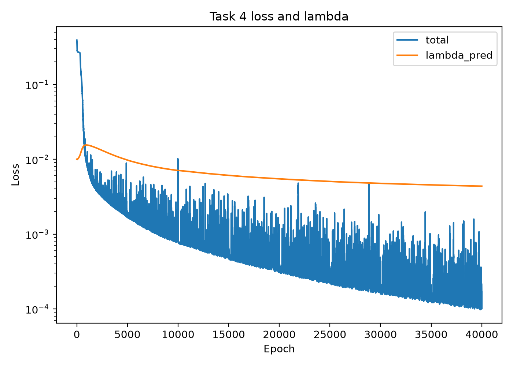

# PINN Fluid Flow Solvers

[中文说明](README.md) · [English](README_EN.md)

[](https://github.com/wangzhengli0327-lgtm/pinn-fluid-flow-solvers/actions/workflows/quality.yml)

This repository provides four PyTorch implementations of physics-informed neural networks (PINNs) for nonlinear fluid-flow problems. It covers forward partial differential equations, two-dimensional incompressible flow, and inverse parameter identification while sharing reusable modules for automatic differentiation, sampling, training, evaluation, and visualization.



## Experiments

| Task | Problem | Model output | Role of data |
| --- | --- | --- | --- |
| 1 | One-dimensional Burgers equation with an analytical solution | Velocity $u(x,t)$ | No external data required |
| 2 | Forward one-dimensional Burgers equation | Velocity $u(x,t)$ | Reference solution for evaluation; optional supervised samples |
| 3 | Steady lid-driven cavity flow at Reynolds number 100 | Velocity $(u,v)$ and pressure $p$ | Velocity magnitude for evaluation; optional supervised samples |
| 4 | Inverse diffusion-coefficient identification for the Burgers equation | Velocity and trainable coefficient $\lambda$ | Observations constrain the field and parameter |

The four entry points are:

```text
task1_burgers_exact.py
task2_burgers_forward.py
task3_cavity_Re100.py
task4_burgers_inverse.py
```

## Highlights

- Physics-informed losses combine PDE residuals, initial conditions, boundary conditions, and optional observations.
- PyTorch automatic differentiation provides the first- and second-order derivatives required by the governing equations.
- Adam optimization is followed by L-BFGS refinement.
- CPU and GPU execution are selected automatically.
- Reproducible random seeds and three presets—`debug`, `light`, and `full`—support both quick checks and complete experiments.
- Training histories, metrics, checkpoints, and publication-ready figures are saved automatically.

## Quick start

Python 3.10 or later is recommended.

```powershell
python -m venv .venv
python -m pip install -r requirements.txt
python task1_burgers_exact.py --mode debug
```

Run the remaining experiments after preparing their reference data:

```powershell
python task2_burgers_forward.py --mode debug
python task3_cavity_Re100.py --mode debug
python task4_burgers_inverse.py --mode debug
```

Use `--help` on any entry point to inspect its available options.

## Data preparation

Tasks 2 and 4 use the public Burgers-equation reference solution from the original PINNs repository. Download and convert it with:

```powershell
python scripts/prepare_burgers_data.py
```

Task 3 expects `data/Cavity_star_data_Re100.txt`. An exact public, redistributable source for this project-specific file has not been verified, so it is not bundled or downloaded automatically. See [the data guide](data/README.md) for column formats and validation commands.

## Result preview

| Analytical comparison | Forward Burgers prediction |
| --- | --- |
|  |  |
| **Cavity-flow streamlines** | **Inverse coefficient identification** |
|  |  |

## Repository layout

```text
src/                         Shared PINN, sampling, training, and plotting modules
scripts/                     Data download and validation utilities
task1_burgers_exact.py       Task 1 entry point
task2_burgers_forward.py     Task 2 entry point
task3_cavity_Re100.py        Task 3 entry point
task4_burgers_inverse.py     Task 4 entry point
requirements.txt             Python dependencies
```

Generated figures, checkpoints, logs, course reports, and large reference datasets are intentionally excluded from version control.

## Reproducibility

The default random seed is `2024` and can be changed with `--seed`. The `debug` preset checks the complete program flow with a small workload, `light` provides a lower-cost experiment, and `full` uses the largest training configuration. Small numerical differences may occur across hardware and PyTorch versions.

## Contributing, citation, and license

Issues and pull requests are welcome. The contribution guide is written in Chinese and is available in [CONTRIBUTING.md](CONTRIBUTING.md). Citation metadata is provided in [CITATION.cff](CITATION.cff).

This project is released under the [MIT License](LICENSE).
